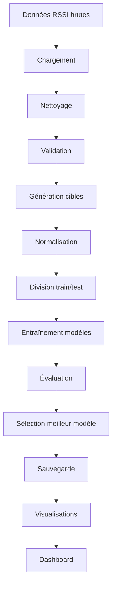

# Guide d'Architecture

## 🏗️ Architecture du Système de Géolocalisation RSSI

Ce document décrit l'architecture complète du projet, les patterns utilisés, et les décisions de conception.

## 📋 Table des Matières

- [Vue d'Ensemble](#vue-densemble)
- [Architecture Modulaire](#architecture-modulaire)
- [Patterns de Conception](#patterns-de-conception)
- [Flux de Données](#flux-de-données)
- [Modèles ML](#modèles-ml)
- [Interface Utilisateur](#interface-utilisateur)
- [Déploiement](#déploiement)

## 🎯 Vue d'Ensemble

### Objectif Architectural
Créer un système modulaire, extensible et maintenable pour la géolocalisation indoor basée sur les signaux RSSI.

### Principes de Conception
- **Modularité** : Séparation claire des responsabilités
- **Extensibilité** : Facilité d'ajout de nouveaux modèles
- **Testabilité** : Code facilement testable
- **Réutilisabilité** : Composants réutilisables
- **Performance** : Optimisation des calculs ML

## 🏛️ Architecture Modulaire

```
geolocalisation-rssi/
├── src/                          # Code source principal
│   ├── data_preprocessing.py     # Traitement des données
│   ├── models.py                 # Modèles de machine learning
│   ├── visualization.py          # Visualisations et graphiques
│   └── dashboard.py              # Interface web interactive
├── tests/                        # Tests unitaires
├── notebooks/                    # Analyses exploratoires
├── data/                         # Données RSSI
├── models/                       # Modèles entraînés sauvegardés
├── reports/                      # Rapports générés
├── logs/                         # Fichiers de logs
├── docs/                         # Documentation
├── config.py                     # Configuration globale
├── main.py                       # Script principal
└── requirements.txt              # Dépendances
```

### Description des Modules

#### 📊 `data_preprocessing.py`
```python
class RSSIDataProcessor:
    """Responsabilités:
    - Chargement des données RSSI
    - Nettoyage et validation
    - Génération de cibles synthétiques
    - Normalisation et standardisation
    - Division train/test
    """
```

#### 🤖 `models.py`
```python
# Hiérarchie des modèles
class BaseRSSIModel:           # Interface commune
class RSSIRandomForestModel:   # Modèle Random Forest
class RSSIXGBoostModel:        # Modèle XGBoost
class RSSIDNNModel:            # Réseau de neurones
class ModelManager:            # Gestionnaire de modèles
```

#### 📈 `visualization.py`
```python
class RSSIVisualizer:
    """Responsabilités:
    - Graphiques de distribution RSSI
    - Comparaison de modèles
    - Cartes de chaleur d'erreurs
    - Importance des features
    - Export HTML
    """
```

#### 🌐 `dashboard.py`
```python
# Dashboard interactif Dash
def create_dashboard():
    """Responsabilités:
    - Interface utilisateur web
    - Prédiction en temps réel
    - Visualisation interactive
    - Analyse des performances
    """
```

## 🎨 Patterns de Conception

### 1. Strategy Pattern (Modèles ML)
```python
# Interface commune pour tous les modèles
class BaseRSSIModel:
    def train(self, X, y): pass
    def predict(self, X): pass
    def evaluate(self, X, y): pass

# Implémentations spécifiques
class RSSIRandomForestModel(BaseRSSIModel): ...
class RSSIXGBoostModel(BaseRSSIModel): ...
class RSSIDNNModel(BaseRSSIModel): ...
```

**Avantages:**
- Facilité d'ajout de nouveaux modèles
- Interchangeabilité des algorithmes
- Tests uniformes

### 2. Manager Pattern (Gestion des Modèles)
```python
class ModelManager:
    def __init__(self):
        self.models = {}
        self.results = {}
    
    def add_model(self, name, model): ...
    def train_all_models(self, X, y): ...
    def evaluate_all_models(self, X, y): ...
    def get_best_model(self): ...
```

**Avantages:**
- Gestion centralisée des modèles
- Comparaison automatique des performances
- Sauvegarde/chargement uniforme

### 3. Factory Pattern (Création de Modèles)
```python
class ModelFactory:
    @staticmethod
    def create_model(model_type: str, **kwargs):
        if model_type == "random_forest":
            return RSSIRandomForestModel(**kwargs)
        elif model_type == "xgboost":
            return RSSIXGBoostModel(**kwargs)
        elif model_type == "dnn":
            return RSSIDNNModel(**kwargs)
```

### 4. Observer Pattern (Logging et Monitoring)
```python
class TrainingObserver:
    def on_epoch_end(self, epoch, logs): ...
    def on_training_end(self, logs): ...

# Utilisé dans les callbacks TensorFlow
```

### 5. Singleton Pattern (Configuration)
```python
class Config:
    _instance = None
    
    def __new__(cls):
        if cls._instance is None:
            cls._instance = super().__new__(cls)
        return cls._instance
```

## 🔄 Flux de Données

### Pipeline Principal


### Flux de Prédiction


## 🧠 Modèles ML

### Architecture des Modèles

#### Random Forest
```python
RSSIRandomForestModel:
    - n_estimators: 100-500
    - max_depth: None (auto)
    - min_samples_split: 2-10
    - Feature importance: Oui
    - Parallélisation: Oui
```

#### XGBoost
```python
RSSIXGBoostModel:
    - n_estimators: 100-1000
    - learning_rate: 0.01-0.3
    - max_depth: 3-10
    - Regularization: L1/L2
    - Early stopping: Oui
```

#### Deep Neural Network
```python
RSSIDNNModel:
    Architecture:
        Input Layer: [n_features]
        Hidden Layer 1: [128] + BatchNorm + Dropout(0.3)
        Hidden Layer 2: [64] + BatchNorm + Dropout(0.3)
        Hidden Layer 3: [32] + BatchNorm + Dropout(0.3)
        Output Layer: [2] (X, Y coordinates)
    
    Optimisation:
        - Optimizer: Adam
        - Learning Rate: 0.001
        - Callbacks: EarlyStopping, ReduceLROnPlateau
        - Regularization: L2(0.001)
```

### Métriques d'Évaluation
- **R² Score** : Coefficient de détermination
- **MAE** : Mean Absolute Error
- **MSE** : Mean Squared Error
- **Distance euclidienne** : Erreur de position réelle

## 🖥️ Interface Utilisateur

### Dashboard Architecture
```python
Dash Application:
    ├── Layout Components
    │   ├── Header
    │   ├── Model Selection
    │   ├── Input Form (RSSI values)
    │   ├── Prediction Display
    │   ├── Position Map
    │   └── Performance Metrics
    │
    ├── Callbacks
    │   ├── update_prediction()
    │   ├── update_map()
    │   ├── update_metrics()
    │   └── export_results()
    │
    └── State Management
        ├── Model cache
        ├── Prediction history
        └── User preferences
```

### Composants Réutilisables
```python
# Composants Dash personnalisés
def create_rssi_input_form(): ...
def create_position_map(): ...
def create_metrics_display(): ...
def create_model_comparison_chart(): ...
```

## 🚀 Déploiement

### Architecture de Déploiement

#### Développement Local
```
Local Machine:
├── Python Environment
├── Jupyter Notebook
├── Dash Server (localhost:8050)
└── File-based Storage
```

#### Production (Option 1: Cloud)
```
Cloud Platform:
├── Container (Docker)
├── Web Server (Gunicorn)
├── Load Balancer
├── Database (PostgreSQL)
├── File Storage (S3/Azure Blob)
└── Monitoring (Prometheus/Grafana)
```

#### Production (Option 2: On-Premise)
```
On-Premise Server:
├── Linux Server
├── Python Environment
├── Nginx Reverse Proxy
├── SQLite/PostgreSQL
└── Local File System
```

### Configuration par Environnement
```python
# config.py
@dataclass
class DevelopmentConfig:
    DEBUG = True
    DATABASE_URL = "sqlite:///dev.db"
    DASH_HOST = "127.0.0.1"
    DASH_PORT = 8050

@dataclass
class ProductionConfig:
    DEBUG = False
    DATABASE_URL = os.environ.get("DATABASE_URL")
    DASH_HOST = "0.0.0.0"
    DASH_PORT = int(os.environ.get("PORT", 8080))
```

## 🔧 Extensibilité

### Ajout d'un Nouveau Modèle
```python
# 1. Créer la classe modèle
class RSSISVMModel(BaseRSSIModel):
    def __init__(self, **kwargs):
        self.model = SVR(**kwargs)
    
    def train(self, X, y): ...
    def predict(self, X): ...

# 2. Ajouter au ModelManager
manager.add_model("SVM", RSSISVMModel())

# 3. Mettre à jour la factory
ModelFactory.register("svm", RSSISVMModel)
```

### Ajout d'une Nouvelle Visualisation
```python
# Dans visualization.py
def plot_rssi_3d_scatter(self, data):
    """Nouvelle visualisation 3D."""
    fig = go.Figure(data=go.Scatter3d(...))
    return fig

# Intégration dans le dashboard
@app.callback(...)
def update_3d_plot():
    return visualizer.plot_rssi_3d_scatter(data)
```

## 📊 Monitoring et Logging

### Architecture de Logging
```python
Logging Hierarchy:
├── Root Logger (INFO)
├── Data Logger (DEBUG)
├── Model Logger (INFO)
├── Dashboard Logger (WARNING)
└── Error Logger (ERROR)

Log Destinations:
├── Console (Development)
├── File (logs/app.log)
├── Rotating File (Production)
└── External Service (Optional)
```

### Métriques de Performance
```python
Performance Metrics:
├── Model Training Time
├── Prediction Latency
├── Memory Usage
├── CPU Usage
├── Accuracy Metrics
└── User Interactions
```

## 🔒 Sécurité

### Considérations de Sécurité
- **Input Validation** : Validation des données RSSI
- **Error Handling** : Gestion sécurisée des erreurs
- **File Access** : Contrôle d'accès aux fichiers
- **Dashboard Security** : Protection contre XSS/CSRF
- **Data Privacy** : Anonymisation des données

## 📈 Performance

### Optimisations Implémentées
- **Caching** : Cache des modèles entraînés
- **Lazy Loading** : Chargement à la demande
- **Vectorisation** : Opérations NumPy optimisées
- **Parallel Processing** : Entraînement parallèle
- **Memory Management** : Gestion efficace de la mémoire

### Benchmarks Typiques
```
Dataset: 1000 échantillons, 50 features
├── Random Forest: ~2s entraînement, ~10ms prédiction
├── XGBoost: ~5s entraînement, ~5ms prédiction
└── DNN: ~30s entraînement, ~1ms prédiction
```

---

**Cette architecture garantit un système robuste, maintenable et extensible pour la géolocalisation indoor ! 🏗️🎯**
